## A Spectrum of Entities That May Mimic Abdominopelvic Abscesses Requiring Image-guided Drainage

Lauren N. Moomjian, MD Ryan D. Clayton, MD Laura R. Carucci, MD

Abbreviations: GIST  =  gastrointestinal  stromal tumor, XGP = xanthogranulomatous pyelonephritis

RadioGraphics 2018; 38:1264-1281

https://doi.org/10.1148/rg.2018170133

Content Codes:

From  the  Department  of  Radiology,  Virginia Commonwealth University Medical Center, 1250 E Marshall St, PO Box 980615, Richmond, VA 23298. Presented as an education exhibit at the 2016 RSNA Annual Meeting. Received May 11,  2017;  revision  requested  September  8  and received  October  3;  accepted  October  12.  For this journal-based SA-CME activity, the authors, editor, and reviewers have disclosed no relevant relationships. Address correspondence to L.R.C. (e-mail: laura.carucci@vcuhealth.org ).

© RSNA, 2018

## SA-CME LEARnIng ObjECTIvES

After completing this journal-based SA-CME activity, participants will be able to:

A variety of entities may mimic drainable abscesses. This can lead to misdiagnosis of these entities, unnecessary percutaneous placement of a pigtail drainage catheter, other complications, and delay in appropriate treatment of the patient. Types of entities that may mimic drainable abscesses include neoplasms (lymphoma, gallbladder cancer, gastrointestinal stromal tumor, ovarian cancer, mesenteric fibromatosis, ruptured mature cystic teratoma, recurrent malignancy in a surgical bed), ischemia/infarction (liquefactive infarction of the spleen, infarcted splenule), diverticula (calyceal, Meckel, and giant colonic diverticula), and congenital variants (obstructed duplicated collecting system). Postoperative changes, including expected anatomy after urinary diversion or Roux-en-Y gastric bypass and small bowel resection, may also pose a diagnostic challenge. Nonpyogenic infections ( Mycobacterium tuberculosis , Mycobacterium avium complex , echinococcal cysts) and inflammatory conditions such as xanthogranulomatous pyelonephritis and gossypiboma could also be misinterpreted as drainable fluid collections. Appropriate recognition of these entities is essential for optimal patient care. This article exposes radiologists to a variety of entities for which percutaneous drainage may be requested, but is not indicated, and highlights important imaging findings associated with these entities to facilitate greater diagnostic accuracy and treatment in their practice.

- Recognize multiple entities that may ■ mimic abdominopelvic abscesses.
- Describe imaging findings to help ■ distinguish these entities from drainable fluid collections/abscesses and avoid misdiagnosis.
- Discuss whether a different imaging ■ modality may provide further information about these entities to avoid further unnecessary intervention.

See rsna.org/learning-center-rg.

© RSNA, 2018 • radiographics.rsna.org

## Introduction

A spectrum of entities can mimic abdominopelvic abscesses. Misdiagnosis of these entities may lead to unnecessary interventions (such as percutaneous catheter placement), other complications, and delay in appropriate patient management. It is important for radiologists to be aware of a variety of entities for which percutaneous drainage may be requested, but is not indicated, to facilitate greater diagnostic accuracy and treatment in their practice.

Types of entities that may mimic drainable abscesses include neoplasms (eg, gallbladder cancer, gastrointestinal stromal tumor [GIST], and other necrotic and/or cavitary neoplasms) (Table 1), as well as ischemia/infarction, diverticula and variants (eg, calyceal and Meckel diverticula), postoperative changes, nonpyogenic infections, and inflammatory conditions such as xanthogranulomatous pyelonephritis (XGP) and gossypiboma (Table 2).

## TEAChIng POInTS

- ■ Types of entities that may mimic drainable abscesses include neoplasms (eg, gallbladder cancer, gastrointestinal stromal tumor [GIST], and other necrotic and/or cavitary neoplasms), as well as ischemia/infarction, diverticula and variants (eg, calyceal and Meckel diverticula), postoperative changes, nonpyogenic infections, and inflammatory conditions such as xanthogranulomatous pyelonephritis (XGP) and gossypiboma.
- ■ A variety of neoplasms, including those with areas of necrosis or fistulization to adjacent bowel loops, may mimic drainable abscesses.
- ■ Owing to the homogeneous cell population, lymphoma can have  a  cystic  appearance  at  ultrasonography  (US).  For  example, in the kidney, lymphoma can mimic a cyst or abscess owing  to  the  well-defined  margins  and  increased  through transmission.
- ■ Foci of air are often seen in and around the infarcted spleen, and these may be seen without the presence of infection.
- ■ At CT, a gossypiboma may appear as a spongiform low-attenuation mass with gas bubbles, a whorled appearance, and prolonged rim enhancement.

This article reviews a spectrum of entities that may be mistaken for drainable fluid collections and techniques for recognition of key features that will allow accurate diagnosis and more optimal patient management.

## neoplasms

A variety of neoplasms, including those with areas of necrosis or fistulization to adjacent bowel loops, may mimic drainable abscesses (1). Neoplasms that could mimic abscesses include lymphoma, gallbladder cancer, GIST, other necrotic malignancies, mesenteric fibromatosis, ruptured dermoid cyst, and recurrent tumor in a surgical bed or along a staple line.

## Lymphoma

Lymphoma is a heterogeneous group of diseases with a wide variety of imaging manifestations. Over 50 subtypes of lymphoma have been recognized by the World Health Organization (2). Lymphoma may be isolated to one organ/organ system or be diffuse.

Owing to the homogeneous cell population, lymphoma can have a cystic appearance at ultrasonography (US). For example, in the kidney, lymphoma can mimic a cyst or abscess owing to the well-defined margins and increased through transmission (3). Replacement of lymph nodes by lymphomatous tissue can also result in a pseudocystic appearance of lymph nodes at US (2). It is important for radiologists to be aware of this potential pitfall, especially in patients with a history of lymphoma.

Lymphoma may mimic the appearance of an abscess at CT and can have similar clinical features (4). For example, primary splenic lymphoma can manifest as a necrotic mass involving the spleen and adjacent organs, including the stomach and pancreas (Fig 1). It is important for radiologists to evaluate the soft-tissue component of the necrotic mass and to look for additional imaging findings including associated lymphadenopathy to facilitate accurate diagnosis. Patients with splenic lymphoma will often have lymphadenopathy, including para-aortic, hilar, and splenic nodal involvement (4).

## gallbladder Cancer

Gallbladder cancer is the fifth most common gastrointestinal malignancy. Cholelithiasis, chronic infection, porcelain gallbladder, and primary sclerosing cholangitis predispose patients to development of gallbladder cancer (5). Only a small percentage of gallbladder cancers arise from adenomatous polyps, whereas the vast majority result from metaplasia and dysplasia related to chronic inflammation (6). Gallstones are present in 60%-90% of cases (6). Gallbladder cancer is diagnosed incidentally in approximately 2% of patients undergoing cholecystectomy performed for other indications (7,8).

At imaging, gallbladder cancer can manifest as an intraluminal polypoid lesion, a mass replacing the gallbladder lumen, or gallbladder wall thickening (7). It may be difficult to distinguish gallbladder cancer from other pathologic conditions-including cholecystitis with abscess and adenomyomatosis-on the basis of imaging and clinical findings (9). To differentiate between gallbladder cancer and other entities, it is important for radiologists to look for ancillary findings associated with gallbladder malignancy including liver invasion, adenopathy, and biliary obstruction, as well as to evaluate the characteristics of the gallbladder wall thickening.

Symmetric and diffuse gallbladder wall thickening favors a nonneoplastic process (7), while asymmetric, irregular, lobulated wall thickening is more suggestive of malignancy (Fig 2). Arterial phase enhancement that persists or becomes isoattenuating/isointense to the liver during the portal venous phase is also more suspicious for malignancy (Fig 2) (7). Overall, the wall thickening associated with malignancy has been found to be more extensive than with cholecystitis (5).

## gastrointestinal Stromal Tumor

GISTs are tumors of mesenchymal origin that can be found throughout the gastrointestinal tract (10). GISTs are most commonly found in the stomach and small intestine, but approximately 5% of all GISTs originate in the rectum (10). While rectal GISTs are uncommon, they are

Table 1: neoplasms That Can Mimic Abdominopelvic Abscesses

| Neoplasms                               | Mimics                                        | Key Distinguishing Features                                                                                                                      |
|-----------------------------------------|-----------------------------------------------|--------------------------------------------------------------------------------------------------------------------------------------------------|
| Lymphoma                                | Cyst, abscess                                 | Soft-tissue component of a necrotic mass Associated lymphadenopathy                                                                              |
| Gallbladder cancer                      | Cholecystitis with abscess, adeno- myomatosis | Asymmetric, irregular, lobulated, and more extensive wall thickening Ancillary findings of liver invasion, adenopathy, and biliary ob- struction |
| Gastrointestinal stro- mal tumor (GIST) | Fluid collection, abscess                     | Peripheral soft-tissue attenuation, wall/soft-tissue thickness >2 cm Adenopathy, distant metastasis                                              |
| Ovarian cancer                          | Fluid collection, ab- scess, peritonitis      | Irregular wall thickening, nodularity Associated findings of adenopathy, ascites, and carcinomatosis                                             |
| Mesenteric fibroma- tosis               | Fluid collection, abscess                     | Irregular wall thickening, nodularity Secondary involvement of bowel                                                                             |
| Ruptured mature cystic teratoma         | Peritonitis, abscess                          | Intratumoral fat Fat-fluid level in ascites Change in morphology of a preexisting dermoid cyst                                                   |
| Recurrent tumor in surgical bed         | Abscess, staple line leak                     | Irregular peripheral soft-tissue thickening along necrotic tumor Enhancing soft tissue Persistent collection                                     |

more likely to be high grade than those arising in the esophagus or stomach (11).

GISTs typically demonstrate a heterogeneous enhancement pattern at CT, extending beyond the bowel, and malignant GISTs may involve adjacent structures (11). A definitive diagnosis may be challenging radiologically because GISTs can appear similar to other gastrointestinal malignancies and can also be mistaken for abscesses. Areas of necrosis and cavitation within the GIST may mimic a fluid collection and prompt a request for drainage (Fig 3). Imaging findings that are suggestive of malignancy rather than infection include soft-tissue attenuation peripherally, wall/ soft-tissue thickness &gt;2 cm (12) (Fig 3), adenopathy, and distant metastasis, including hepatic metastasis.

## Ovarian Cancer

Ovarian malignancy encompasses a heterogeneous group of neoplasms originating from the ovaries, fallopian tubes, or peritoneum and is the fifth leading cause of cancer death among women in the United States (13). The most common type of ovarian tumor is the epithelial stromal tumor, encompassing approximately 90% of malignant ovarian tumors (13). In addition, the ovary is a common site of metastasis including from gastrointestinal tumors, which account for approximately 40% of cases of ovarian metastasis (14).

Necrosis, manifesting as foci of air and low attenuation at CT, can be present in both primary and secondary ovarian neoplasms, potentially mimicking the appearance of a fluid collection/abscess (15) (Fig 4). However, ovar- ian neoplasms will typically be thick walled and demonstrate irregular wall thickening and enhancement (15). Radiologists should be aware of this imaging appearance and look for additional findings in the abdomen and pelvisincluding adenopathy, ascites, abnormal softtissue attenuation, and carcinomatosis-to help diagnose ovarian neoplasm and distinguish this entity from a fluid collection/abscess.

## Mesenteric Fibromatosis/Desmoid Tumor

Mesenteric fibromatosis, also known as abdominal desmoid tumor, is a type of benign fibrous tumor that occurs sporadically in the majority of cases but also has an association with Gardner syndrome (16). Intra-abdominal desmoid tumors can occur in the retroperitoneum, mesentery, or pelvis (16).

The typical CT appearance of mesenteric fibromatosis is a homogeneous soft-tissue mass. However, a minority of abdominal desmoid tumors can manifest as a low-attenuation mass with cystic change (17). It is important for radiologists to be aware of this entity, its varied imaging appearances, and the potential complication of erosion into adjacent bowel loops.

When mesenteric fibromatosis erodes into adjacent small bowel loops, this results in development of gas within the mass or abscess formation mimicking a fluid collection (Fig 5). Mesenteric fibromatosis is typically treated surgically; however, the appearance of air within the mass can pose a diagnostic dilemma and lead to inappropriate catheter drainage (Fig 5) rather than surgical management if not appropriately diagnosed (17-19).

Table 2: Other Entities That Can Mimic Abdominopelvic Abscesses

| Entities                                                   | Mimics                                           | Key Distinguishing Features *                                                                                                                               |
|------------------------------------------------------------|--------------------------------------------------|-------------------------------------------------------------------------------------------------------------------------------------------------------------|
| Liquefactive infarction of spleen                          | Peripherally enhancing fluid collection, abscess | Maintained splenic configuration Rim of preserved splenic parenchyma                                                                                        |
| Infarcted splenule                                         | Fluid collection, abscess                        | Location Findings of prior studies Findings at follow-up MRimaging                                                                                          |
| Calyceal diverticulum                                      | Simple and complex renal cyst, renal abscess     | Gradual filling in with excreted contrast material at excretory phase imaging Visualization of neck of diverticulum                                         |
| Duplicated collecting system                               | Renal cystic lesion, fluid col- lection, abscess | Look for and follow the ureters Findings of prior studies may be helpful                                                                                    |
| Meckel diverticulum                                        | Abscess                                          | Tubular configuration of fluid collection Location: right lower quadrant, associated with distal ileum, may be in vicinity of umbilicus                     |
| Giant colonic diver- ticulum                               | Fluid collection, abscess                        | Location Visualization of neck of diverticulum Findings of prior studies                                                                                    |
| Indiana pouch urinary diversion                            | Complex fluid collection, abscess                | Connection from ureters to pouch and absence of native urinary bladder Excreted contrast material filling pouch                                             |
| Distended excluded stomach after Roux- en-Y gastric bypass | Fluid collection, abscess                        | Recognize postoperative anatomy including alimentary and biliopancreatic limbs Connection to intact biliopancreatic limb                                    |
| Small bowel anasto- mosis                                  | Fluid collection, abscess                        | Recognize postoperative anatomy including staples or sutures Communication with small bowel loops Configuration of small bowel folds                        |
| Mycobacterium tuber- culosis                               | Fluid collection, abscess                        | Rind of soft tissue Nodes follow mesenteric vessels Bulky soft-tissue adenopathy elsewhere                                                                  |
| Echinococcal cyst                                          | Abscess, hematoma, cystic neoplasm, pseudocyst   | Wall calcification Identification of daughter cysts Membrane detachment Findings at diffusion-weighted MRimaging                                            |
| Xanthogranuloma- tous pyelonephritis (XGP)                 | Malignant renal tumors, tuberculosis, abscess    | Enlarged kidney Renal obstruction Stones Diminished to absent renal enhancement                                                                             |
| Gossypiboma                                                | Abscess, soft-tissue mass                        | Associated radiopaque surgical material Radiopaque marker on scout image for CT Thick peripheral enhancing wall Whorled internal configuration at MRimaging |

* CT = computed tomography, MR = magnetic resonance.

## Ruptured Mature Cystic Teratoma

A mature cystic teratoma (dermoid cyst) is a common ovarian neoplasm composed of three germ cell layers (20), typically containing ectodermal tissue (skin, brain), mesodermal tissue (muscle, bone, fat), and endodermal tissue (mucinous or ciliated epithelium). The presence of an intratumoral fat component is the characteristic imaging finding (Fig 6), with internal fat content found at CT in 93% of cases. Fluid, soft-tissue attenuation, and calcifications may be present to a varying degree. Teeth or calcification are found in 56% of cases (21). Mature cystic teratomas can grow slowly over time (22).

Complications of dermoid cysts may include rupture, torsion, and malignant degeneration. Dermoid cyst rupture is rare and occurs in approximately 1.2%-3.8% of patients (20). Leakage of liquefied sebaceous contents into the peritoneum can manifest as acute peritonitis in the setting of sudden rupture or as chronic granulomatous peritonitis. Sudden rupture can be precipitated by an event such as torsion, labor, infection, or trauma. Chronic leakage

Figure  1. Lymphoma.  Axial  contrast-enhanced  CT  image shows an ill-defined mass with central low attenuation along the pancreatic tail (P) extending into the spleen (white arrows). Owing  to  the  central  cystic  component,  this  was  thought to  represent  infection/abscess.  CT-guided  drainage  was  attempted, but only minimal fluid was aspirated (not shown). At pathologic analysis of a specimen from subsequent core biopsy, results were consistent with lymphoma. Although there is central hypoattenuation, note that the mass has a thick rim of soft tissue; the central low attenuation represents necrosis. Also note the enlarged retroperitoneal lymph nodes and confluent retroperitoneal soft tissue (black arrows).

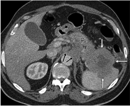

occurs more commonly and can result in dense peritoneal adhesions, which can mimic tuberculosis or carcinomatosis.

Imaging manifestations of dermoid cyst rupture include distorted or flattened shape of the tumor, ascites, and diffuse or focal omental infiltration (Fig 6) (23). To distinguish a ruptured dermoid cyst from other causes of peritonitis, it is important to carefully compare the dermoid morphology and size to those in prior examinations and to assess for the presence of a fat-fluid level within the ascitic fluid.

## Recurrent Malignancy in a Surgical bed/ along a Staple Line

After resection of a neoplasm, follow-up imaging may be performed to assess for local-regional recurrence and distant metastases. Multiple gastrointestinal and genitourinary neoplasms pose a risk of local recurrence as well as distant metastasis. It may be difficult to distinguish postsurgical change/infection at the staple line from recurrent neoplasm, especially if no prior imaging studies are available and the recurrent neoplasm has a necrotic appearance.

Recurrent Colon Cancer.The reported incidence of local recurrence in colon cancer overall is 2%4%; however, rectal neoplasms have a higher reported rate of local recurrence (24). The majority of local staple-line recurrences after resection for colon cancer occur within 3 years postoperatively

Figure 2. Gallbladder cancer in a patient who presented to the emergency department with right upper quadrant pain and elevated white blood cell count. Axial contrast-enhanced CT image shows an abnormal gallbladder (G) with lobulated wall thickening, which was thought to represent chronic cholecystitis. Aspiration was performed and purulent material was drained; therefore, a cholecystostomy tube was placed (not shown). Follow-up MR imaging demonstrated two small liver lesions. Pathologic analysis of a specimen from subsequent liver biopsy showed gallbladder cancer. On further review, note the nodular soft-tissueattenuation wall thickening (arrows) with enhancement that is isoattenuating to the liver in the portal venous phase.

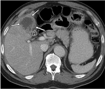

Figure 3. Rectal GIST in a patient with rectal bleeding and elevated white blood cell count. Axial contrast-enhanced CT image shows a presacral/perirectal fluid-filled structure with an air-fluid  level  (black  arrow),  which  was  thought  to  represent an abscess. However, the mass has a large, heterogeneously enhancing, lobulated soft-tissue component peripherally, most pronounced along the right lateral/posterior aspect (white arrows), with a thick peripheral rind of soft tissue, indicating a necrotic neoplasm rather than an abscess. Note the rectum (R) displaced anteriorly. Pathologic analysis revealed a GIST arising from the rectum.

(25) but have been reported up to 10 years after the initial surgery.  The presence of an anastomotic leak or intra-abdominal abscess has been found to

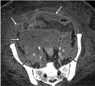

Figure 4. Ovarian carcinoma in a patient after debulking for high-grade ovarian carcinoma. Axial contrast-enhanced CT image shows complex fluid throughout the pelvis with foci of extraluminal air and peripheral enhancement (white arrows). This was interpreted as abdominal abscesses/peritonitis. CT-guided placement of a drainage catheter was attempted (not shown), but no pus was aspirated. The complex  fluid  was  sent  for  cytologic  analysis,  which  revealed carcinomatosis. On further review, note the confluent softtissue attenuation encasing the iliac vessels (black arrows). The complex fluid with peripheral enhancement throughout the pelvis represents carcinomatosis and is contiguous with the soft-tissue attenuation along the iliac vessels.

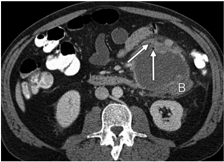

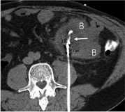

a

b

Figure 5. Mesenteric fibromatosis. (a) Axial contrast-enhanced CT image shows a rim-enhancing mesenteric mass with internal foci of air (arrows) that involves adjacent small bowel loops (B) . This was interpreted as contained bowel perforation with abscess formation. (b) Axial CT image shows a percutaneous drainage catheter placed in the mass (arrow). The patient was taken to the operating room 1 day after drain placement, with pathologic analysis showing mesenteric fibromatosis with abscess formation. On further review, there is nodular thickening along the anterior margin of the mass with involvement of the adjacent small bowel (B) by the mass, likely accounting for the gas within the mass. Also, there is no associated bowel wall thickening, and there are prominent mesenteric lymph nodes adjacent to the mass anteriorly.

increase the risk of local recurrence after resection of higher-stage rectal cancer (26). Differentiating necrotic tumor from abscess can pose a diagnostic dilemma (24), both at positron emission tomography (PET)/CT and conventional CT. Radiologists should evaluate for peripheral/irregular soft-tissue thickening to help differentiate necrotic recurrent tumor from infection (Fig 7).

Recurrent Urothelial Cancer.Genitourinary tract neoplasms may also recur in the surgical bed after resection, including urothelial carcinoma (Fig 8), prostate carcinoma, and renal cell carcinoma. Upper tract urothelial neoplasms account for approximately 10% of renal neoplasms and 5% of urothelial neoplasms (27). Patients with upper tract urothelial neoplasms are typically treated surgically, including nephroureterectomy and removal of a cuff of urinary bladder (28).

Recurrent urothelial carcinoma can manifest as urothelial, retroperitoneal, or distant recurrence (27).  While the majority of patients with recurrent urothelial carcinoma present with bladder tumors, reported as approximately 51%, recurrence may also occur in the retroperitoneum in approximately 9%-17% of patients, including in the surgical bed or retroperitoneal lymph nodes (27,29). Although a fluid collection in the surgical bed is a common occurrence in the immediate postoperative period, if the collection persists despite appropriate drainage or if enhancing soft-tissue attenuation is identified in the surgical bed, the possibility of local recurrence must be considered (Fig 8).

## Ischemia/Infarction

Complete liquefactive infarction of the spleen or an accessory splenule can mimic a fluid collection, prompting percutaneous catheter drainage.

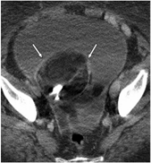

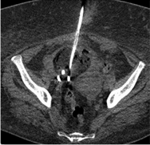

b

Figure 6. Ruptured dermoid cyst in a patient with a history of cirrhosis. (a) Axial contrast-enhanced CT image shows a right adnexal mass containing macroscopic fat and calcification or a tooth (arrows), consistent with a dermoid cyst. There is a large surrounding volume of ascites with thickening and enhancement of the peritoneal surfaces. Differential considerations included increasing ascites with peritonitis versus dermoid cyst rupture. Review of a prior CT study (not shown) showed that the dermoid cyst had decreased in size and changed in configuration, consistent with cyst rupture. Percutaneous drainage was performed owing to the patient's comorbidities and contraindications to surgical management. (b) Axial nonenhanced CT image from follow-up study after drainage catheter placement shows decreased pelvic fluid volume.

It is important for radiologists to be aware of these entities and their appearances, as clinical and imaging findings of infarction can mimic those of infection.

## Liquefactive Infarction of the Spleen

Multiple entities can predispose patients to development of splenic infarcts, including splenomegaly, hemoglobinopathies, thromboembolic disorders, sepsis, and recent surgery or instrumentation (30). Splenic infarcts may be variable in size and can rarely involve the entire spleen, nearly replacing normal splenic parenchyma with fluid attenuation (30). Typically, peripheral capsular enhancement persists, potentially mimicking a peripherally enhancing fluid collection. Foci of air are often seen in and around the infarcted spleen, and these may be seen without the presence of infection (Fig 9).

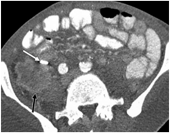

To distinguish an infarcted spleen from a splenic or splenectomy bed abscess, the patient's surgical history is essential.  Without this history, it is important to look at the morphology of the 'fluid collection' at imaging (often the splenic configuration will be maintained), compare with the appearance in prior examinations, and evaluate for a rim of preserved splenic parenchyma, which will be seen in the setting of splenic infarct. If the splenic infarct is misinterpreted as a splenic or splenectomy bed abscess, this can lead to inappropriate drainage catheter placement into the spleen itself (Fig 9). Once splenic infarction is recognized, it is important to try to determine the cause.

Figure  7. Recurrent  colon  cancer  in  a  patient with  a  history  of  partial  right  colectomy.  Contrast-enhanced  CT  image  shows  a  peripherally enhancing right lower quadrant 'fluid collection' adjacent  to  an  ileocolic  anastomosis-this  was thought to represent an abscess or anastomotic leak. Aspiration was attempted but no fluid was obtained.  Core  biopsy  samples  were  obtained for  cytopathologic  analysis  and  culture.  Biopsy results were consistent with recurrent colon adenocarcinoma.  On  further  review,  the  'collection'  represents  a  centrally  necrotic  mass  with peripheral  enhancement  (black  arrow)  adjacent to a surgical clip (white arrow).

## Infarcted Splenule

A splenule, or accessory spleen, is a congenital focus of splenic tissue separate from the spleen that is usually asymptomatic and discovered incidentally at imaging. As the spleen itself is formed by coalescent splenules, splenules are common, found in approximately 10%-30% of patients at autopsy. The imaging appearance of a normal splenule is a homogeneous soft-tissue mass mea-

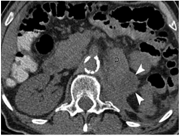

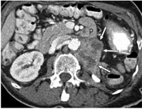

b

Figure  8. Recurrent  urothelial  cancer  in  a  patient  after  left  nephrectomy  for  urothelial  carcinoma. (a) Axial  nonenhanced CT image shows a retroperitoneal 'fluid collection' (arrowheads) inseparable from the pancreatic tail (P) and tracking in the surgical bed. CT-guided drainage was performed (not shown). The fluid amylase level was 23  312 U/L (388.6 μ kat/L). (b) Follow-up axial contrast-enhanced CT image 2 months later shows heterogeneously enhancing soft tissue in the surgical bed (arrows) with a drainage catheter in place. A repeat request was made for drainage of a persistent leak; however, biopsy was performed owing to the enhancing soft tissue and revealed necrotic recurrent tumor. Note the peripherally enhancing soft-tissue components of the heterogeneous necrotic mass. P = pancreatic tail.

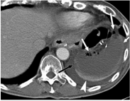

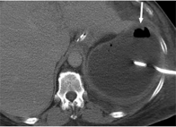

b

Figure 9. Liquefactive infarction of the spleen. (a) Axial contrast-enhanced CT image in a patient after gastric carcinoma resection shows a left upper quadrant peripherally enhancing 'fluid collection' containing air and fluid attenuation. This was thought to represent an abscess after splenectomy. However, the patient had not undergone splenectomy at the time of gastric resection. The 'collection' represents near-complete infarction of the spleen with air in and adjacent to the spleen (white arrows). However, also note the capsular enhancement (black arrow) and rim of preserved splenic parenchyma (arrowhead). Also, the splenic configuration is maintained. (b) Axial contrast-enhanced CT image in another patient shows near-complete infarction of the spleen with internal foci of air (arrow). This was misinterpreted as an abscess, with placement of a drainage catheter into the infarcted spleen.

suring less than 2 cm that follows the attenuation or signal intensity characteristics and enhancement pattern of the spleen (31).

may allow further characterization of a possible splenule if the diagnosis is uncertain (Fig 10).

Splenules derive their blood supply from the splenic arterial system and can rarely become symptomatic in the setting of wandering spleen, splenic infarction, or torsion. Therefore, it is important for radiologists to examine the spleen and assess the location of the splenic hilum if an infarcted or torsed splenule is suspected (Fig 10). The CT appearance of an infarcted splenule may be similar to that of an abdominal abscess or fluid collection, manifesting as a round circumscribed low-attenuation lesion with surrounding soft-tissue stranding (Fig 10). MR imaging or US

## Diverticula and variants

There are several diverticula and normal variants in the abdomen and pelvis that can pose a diagnostic dilemma and be mistaken for fluid collections, including bowel diverticula (such as Meckel diverticulum and giant colonic diverticulum), renal calyceal diverticula, and an obstructed upper pole moiety of a duplicated renal collecting system.

## Calyceal Diverticulum

Calyceal diverticula are cystic urine-containing structures lined by transitional epithelium (32),

Figure 10. Infarcted splenule in an 8-year-old patient with abdominal pain. (a) Axial contrast-enhanced CT image shows a hypoattenuating left upper quadrant mass with surrounding inflammation (arrow). The differential diagnosis included a complex fluid collection. However, also note the two adjacent homogeneously enhancing splenules (arrowheads). (b) Axial contrast-enhanced CT image from the same examination shows a wandering spleen with the splenic hilum directed laterally (arrow), which was noted on further review of the images. The differential diagnosis was expanded to include an infarcted splenule. (c) Follow-up Doppler US image shows a splenule without internal flow (arrow) and an adjacent vascularized splenule (arrowhead).

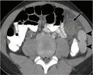

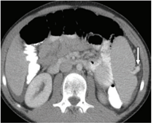

a

which are uncommonly identified at renal imaging in approximately 0.5% of patients (33). There are two types: type 1 calyceal diverticula communicate with an adjacent renal calyx, while type 2 calyceal diverticula communicate with the renal pelvis through a narrow neck. This entity may pose a diagnostic dilemma for radiologists, as the imaging appearance can mimic that of multiple other entities including renal abscess. Additionally, calyceal diverticula can have complex contents.

The classic US appearance is a cystic structure with mobile echogenic material. However, it is typically difficult to identify the neck of the diverticulum sonographically, and the US appearance is often atypical for a simple renal cyst (Fig 11). The differential diagnosis for a calyceal diverticulum at US is broad and includes simple cyst, complex cyst, and abscess (33).

At single-phase contrast-enhanced CT, a diverticulum can be difficult to distinguish from a cystic neoplasm, complex cyst, or abscess owing to complex contents or an (irregular) enhancing wall, which can be seen in some cases (Fig 11). Multiphase CT may be necessary to clarify the diagnosis. On delayed excretory phase CT images, the calyceal diverticulum should gradually fill in with excreted contrast material (33) (Fig 11). The neck of the diverticulum may also be identified.

## Duplicated Collecting System

A duplicated collecting system is the most common type of normal variant renal anatomy, with a reported prevalence of 0.3%-6% (34,35). The upper pole moiety is predisposed to obstruction, while the lower pole moiety is predisposed to reflux. While some patients are diagnosed at fetal or pe-

b

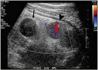

diatric imaging, many are asymptomatic and may present as adults with a previously undiagnosed duplicated collecting system at imaging (35,36).

In patients with chronic obstruction of the upper pole moiety, severe parenchymal atrophy can occur (Fig 12). A severely atrophic upper pole moiety with a dilated upper pole collecting system can be confused with a renal cyst or fluid collection if the duplicated collecting system morphology is not recognized (Fig 12) (35,37,38). When a duplicated collecting system is recognized, it is important to follow the ureters and assess for the presence of an ectopic ureteral insertion, which is associated with chronic obstruction of the upper pole moiety.

## Meckel Diverticulum

Meckel diverticulum is a type of congenital small bowel diverticulum found in approximately 2%-3% of patients that arises from the antimesenteric border of the ileum approximately 30-60 cm proximal to the ileocecal valve (39,40). Although complications from Meckel diverticu-

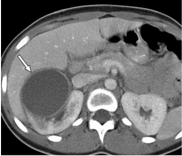

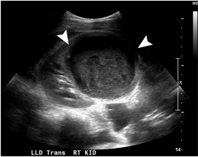

b

Figure 11. Infected calyceal diverticulum in a patient with right flank pain. (a) Axial contrast-enhanced CT image shows a peripherally enhancing complex cystic structure in the right kidney (arrow), which was initially thought to represent a renal abscess. (b) Follow-up gray-scale US image shows a complex cystic mass in the mid right kidney with internal echogenic material (arrowheads). There is a mild increase in size compared with that at CT. The mass remained concerning for abscess. No internal vascularity was seen at color flow imaging (not shown). Therefore, USguided drainage was performed (not shown), followed by CT after intravenous administration of contrast material. (c) Coronal excretory phase CT image shows interval decrease in the size of the abnormality (arrowhead), which fills with excreted contrast material and represents a calyceal diverticulum. Note the connection to the collecting system (arrow).

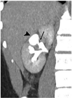

## giant Colonic Diverticulum

lum typically occur in the first 2 decades of life, approximately 30% of complications may occur in adult patients (40). Overall, complications affect approximately 16% of patients with Meckel diverticulum (41). The most common complications of Meckel diverticulum in adults include bleeding, obstruction, and diverticulitis (41).

Therefore, Meckel diverticulum and Meckel diverticulitis should be included in the differential diagnosis of an inter-loop air and fluid collection remote from the ileocecal valve and sigmoid colon (39,42) (Fig 13). Meckel diverticulitis can often be seen as an air and fluid collection in the vicinity of the umbilicus owing to the persistence of a fibrous cord from the omphalomesenteric duct connecting the Meckel diverticulum to the umbilicus in some patients (43). A tubular configuration of the air and fluid collection would suggest the diagnosis of Meckel diverticulum rather than abscess (44).

Meckel diverticulum and diverticulitis are often not included in the clinical differential diagnosis. These entities should be considered when evaluating a right lower quadrant or pelvic inflammatory process or fluid collection to facilitate accurate diagnosis and appropriate treatment, typically surgical treatment.

A giant colonic diverticulum is a rare entity and may be a pseudodiverticulum, inflammatory diverticulum, or less commonly a true diverticulum (measuring &gt;4 cm), typically arising from the sigmoid colon (45-47). Histologically, three types have been described: Type 1 is a pseudodiverticulum composed of remnants of muscularis mucosa, inflammatory cells, and fibrous tissue. Type 2 is an inflammatory diverticulum composed of scar tissue only arising from local perforation and abscess formation. Type 3 is a true giant colonic diverticulum containing all bowel wall layers. Type 2 giant colonic diverticula are most common, accounting for approximately two-thirds of cases (66%), while true diverticula are rare, accounting for approximately 12% of cases (47).

At CT, a giant colonic diverticulum appears as a thin-walled pericolonic air and fluid collection (measuring &gt;4 cm) adjacent to the sigmoid colon (Fig 14) (48).  The diverticulum may develop wall thickening and increased enhancement in the setting of acute inflammation/diverticulitis (49). Careful image evaluation may reveal the presence of a connection to the colon. This can be demonstrated at imaging in approximately 80% of cases (Fig 14). In the remainder of cases, the communication to the colon is diminutive, seen only at pathologic analysis (45). In many cases, the communication to the colon cannot be identified endoscopically (47), also contributing to misdiagnosis.

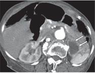

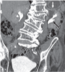

b

Figure 12. Duplicated collecting system with obstructed upper pole moiety in a 90-year-old patient with shortness of breath. (a) Axial contrast-enhanced chest CT angiogram shows a finding interpreted as a 'rim-enhancing left upper quadrant fluid collection' (arrows), consistent with an abscess. (b) Coronal excretory phase image from prior CT urography shows that, on further review, the 'collection' represents an atrophic obstructed upper pole moiety in a duplicated left collecting system. Note the excreted contrast material in the nondilated lower pole moiety (black arrow) and the rim of atrophic renal parenchyma (white arrow).

Figure 13. Meckel diverticulum in a 36-year-old man with abdominal pain and guarding. Axial contrast-enhanced CT image shows a small 'air and fluid collection' with adjacent fat stranding (white arrow), which was initially interpreted as an abscess. However, on further review, the 'collection' is tubular, blind ending, and closely associated with the distal ileum (black arrow), consistent with an inflamed Meckel diverticulum. The inflammatory change is associated with the diverticulum itself and not primarily with the adjacent opacified ileum.

Potential complications of giant colonic diverticulum include perforation, abscess formation, and bowel obstruction. The treatment of choice is surgical management, although high-risk, elderly, and asymptomatic patients may be managed conservatively (46-48).

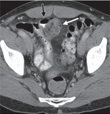

## Postoperative Findings

There are a number of postoperative findingsincluding Indiana pouch urinary diversion, excluded stomach after Roux-en-Y gastric bypass, and small bowel anastomosis-that may mimic drainable fluid collections if not recognized as expected findings after gastrointestinal or genitourinary surgical procedures.

## Indiana Pouch Urinary Diversion

Indiana pouch urinary diversion is a continent urinary diversion procedure following cystectomy. An Indiana pouch reservoir is composed of cecum and ascending colon. A catheterizable cutaneous stoma is used for urine drainage. The expected imaging appearance is a fluid-filled structure in the right lower quadrant that may contain air secondary to catheterization.

The colonic haustra can be mistaken for septa at both CT and US, and the presence of air can lead to misdiagnosis as a complex fluid collection if the postoperative anatomy is not recognized (Fig 15) (50). It is important to follow the ureters, assess for a urostomy, and evaluate for the absence of a normal/native urinary bladder. Review of the medical record, surgical history, and any prior examinations may also help facilitate accurate diagnosis (Fig 15).

## Distended Excluded Stomach after Roux-en-Y gastric bypass

Roux-en-Y gastric bypass is a commonly performed bariatric surgical procedure that uses a combination restrictive-malabsorptive technique to achieve weight loss (51,52). A small gastric pouch is created and anastomosed to a Roux jejunal limb as a conduit for food, bypassing the remainder of the stomach and the biliopancreatic limb. The remainder of the stomach is left in place (excluded stomach) and remains continu-

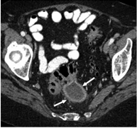

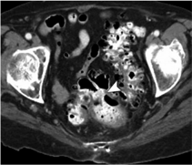

b

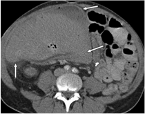

Figure 14. Giant colonic diverticulum in an 83-year-old patient with recurrent abdominal pain. (a) Axial contrastenhanced CT image shows a 'complex pelvic air and fluid collection' (arrows), which was thought to represent a pericolonic abscess. CT-guided aspiration was performed (not shown). (b) Follow-up axial contrast-enhanced CT image with oral and intravenous contrast material shows that the 'collection' persists, fills with oral contrast material, and communicates with the adjacent sigmoid colon, consistent with a giant colonic diverticulum. Arrowhead = communication with sigmoid colon.

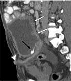

b

Figure 15. Indiana pouch urinary diversion in a 31-year-old patient with abdominal pain who was transferred from another hospital for drainage of a 'fluid collection.' (a) Axial contrast-enhanced CT image shows a large complex 'air and fluid collection' (arrows) in the right side of the midabdomen. (b) Sagittal excretory phase CT image from a prior examination shows that the 'collection' represents a dilated obstructed Indiana pouch urinary diversion (white arrows) containing complex fluid and blood products, including excreted intravenous contrast material (black arrow). Also note the urostomy (arrowhead).

ous with the duodenum (excluded biliopancreatic limb). A jejunal-jejunal anastomosis is created 25-50 cm distal to the ligament of Treitz, thereby shortening the length of functional small bowel.

and fluid filled (Fig 16). If the expected postoperative anatomy is not recognized, the radiologist may misdiagnose a fluid-filled excluded stomach as a drainable fluid collection (51) (Fig 16).

Both the gastric pouch and excluded stomach should be identified by radiologists interpreting CT or MR images after Roux-en-Y gastric bypass. It is also important to follow the Roux limb and biliopancreatic limb downstream. The excluded stomach is normally collapsed. However, in some patients, for example in the setting of a small bowel obstruction involving the excluded biliopancreatic limb, the excluded stomach can become dilated

## Small bowel Anastomosis

After partial small bowel resection, a small bowel anastomosis is often created as a side-to-side anastomosis. This typically will have a larger diameter focally at the anastomosis as compared with the diameter of adjacent small bowel loops, owing to its side-to-side nature and without associated small bowel obstruction. A radiopaque bowel

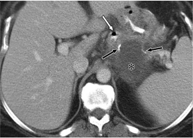

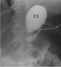

b

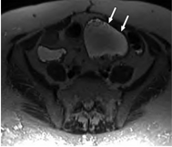

Figure  16. Distended excluded stomach in a patient after Roux-en-Y gastric  bypass  who presented to the emergency department with abdominal pain. (a) Axial contrast-enhanced CT image shows an upper abdominal 'fluid collection.' On further review, the 'collection' represents the oversewn proximal excluded stomach ( * ), which is dilated and fluid filled. Also note the adjacent staple lines (black arrows) and oral contrast material in the gastric pouch (white arrow). (b) Fluoroscopic image shows placement of a drainage catheter into the excluded stomach (ES) .

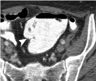

a

b

Figure 17. Small bowel anastomosis in a 47-year-old patient with a history of Crohn disease with abdominal pain who was transferred from another hospital for drainage of a 'pelvic fluid collection.' (a) Axial T2-weighted MR image shows the 'fluid collection' (arrows). (b) Axial contrast-enhanced CT image from a prior examination shows oral contrast material opacifying the 'collection,' which represents a side-to-side small bowel anastomosis. Note that foci of air and the small bowel suture line (arrowhead) are better appreciated with CT than with MR imaging.

suture line may aid in appropriate diagnosis. The orientation of the small bowel folds and following adjacent small bowel loops communicating with the anastomosis are helpful to avoid misidentification as a fluid collection (Fig 17). Additionally, prior examinations that demonstrate oral contrast material opacification of the structure and review of the patient's surgical history, if available, can help facilitate correct diagnosis.

## M Tuberculosis/M Avium Complex

## nonpyogenic Infections

Several types of nonpyogenic infection may mimic pyogenic abscess formation-including Mycobacterium tuberculosis , Mycobacterium avium complex , and echinococcal cysts-leading to inappropriate catheter drainage of these entities.

M tuberculosis and M avium complex can cause abdominal infections with similar clinical and imaging features. Abdominal M avium complex infection is seen in immunocompromised hosts, whereas M tuberculosis infection can occur in both normal and immunocompromised patients. Both infections are more common in human immunodeficiency virus (HIV) patients with low CD4 cell counts (&lt;200/µL [0.2 3 10 9 /L]), and patients present with abdominal pain, fever, and B symptoms (53).

Abdominal manifestations are variable and include involvement of the intestinal tract, lymph nodes, peritoneum, and/or solid abdominal organs (54). Bulky abdominal lymphade-

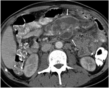

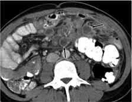

b

Figure 18. M avium complex infection in a patient with HIV infection who presented with intermittent fevers. (a) Axial contrastenhanced CT image shows a 'peripherally enhancing mesenteric fluid collection' (arrows). This was thought to represent an abscess. (b) Image obtained inferior to a shows a few more discrete similar-appearing 'collections' coursing along the mesenteric vessels (arrows). These represent necrotic lymph nodes, confluent superiorly and more discrete inferiorly. Blood culture showed M avium complex . The 'fluid collection' in a actually represents confluent mesenteric adenopathy with central necrosis.

nopathy is characteristic. At CT, lymph nodes can develop central low attenuation and peripheral enhancement related to central necrosis and caseation, mimicking a drainable abscess, especially when in the mesentery (Fig 18). This finding is more common in M tuberculosis infection than in M avium complex infection (53). Careful inspection will show the true nature of confluent mesenteric nodes, following the mesenteric vessels.

## Echinococcal Cyst

Hydatid disease is a parasitosis most commonly caused by Echinococcus granulosus. This infection is more commonly seen in the developing world but occurs worldwide (55,56). Almost any organ can be affected by hydatid disease; however, the majority of cases (approximately 76%) involve the liver (57).

Hydatid disease in the solid abdominal organs, including the liver and spleen, classically manifests as a slowly growing cystic mass, which may first occur in childhood but may not be discovered until the 3rd or 4th decade. The imaging appearance is variable, and hydatid cysts may be unilocular or multilocular, single or multiple, and thin or thick walled (58). The imaging appearance is similar to that of other entities including abscess, hematoma, cystic neoplasm, and pseudocyst (Fig 19). Specific imaging findings of hydatid cyst include wall calcification, identification of daughter cysts, and membrane detachment (55-57).

If the diagnosis remains uncertain, multiple studies have reported diffusion and apparent diffusion coefficient (ADC) cutoff values to distinguish hydatid cyst from abscess using MR imaging, with significantly lower ADC values for abscesses (which cause diffusion restriction) than for hydatid (and simple) cysts (56). It is important for radiologists worldwide to be aware of this entity and the appropriate management. Owing to the risk of cyst rupture and its associated potential complications, many hydatid cysts are treated surgically, and percutaneous drainage may be contraindicated.

## Inflammatory Conditions

Uncommon inflammatory conditions such as XGP and gossypiboma can pose a diagnostic dilemma for the radiologist and mimic other entities including abscesses.

## Xanthogranulomatous Pyelonephritis

Xanthogranulomatous inflammation refers to a type of chronic inflammation characterized by destruction of normal tissue and accumulation of lipid-laden macrophages and other inflammatory cells. It can involve any organ but most commonly involves the kidneys. XGP occurs in the setting of chronic obstruction and is most commonly seen in the presence of nephrolithiasis. Women are affected more frequently than men, and common symptoms include fever, flank pain, weight loss, lower urinary tract symptoms, and gross hematuria (59). Diffuse and focal forms are described, with focal XGP occurring much less commonly in approximately 8% of cases (60).

CT is valuable in preoperative evaluation of XGP, with typical imaging features including hydronephrosis, an enlarged kidney, severely impaired renal excretion, renal calculi, and air in the collecting system (59,61). CT is also accurate in determining extrarenal extent, as

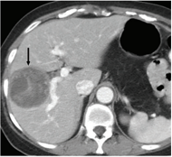

b

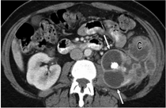

Figure 19. Echinococcal cyst in a 57-year-old woman with a history of breast cancer who presented with abdominal pain. (a) Doppler US image shows a solitary complex cystic mass (arrows) in the liver. Initial differential considerations included abscess, hematoma, and metastasis. (b) Follow-up axial contrast-enhanced CT image shows a large, mildly heterogeneous, septate complex cyst (arrow). Aspiration was performed, and pathologic analysis showed Echinococcus .

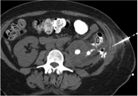

b

Figure 20. XGP in a 50-year-old patient with left flank pain. (a) Axial contrast-enhanced CT image shows a staghorn calculus in the left kidney and a 'perirenal abscess' with mass effect on the descending colon (C) . CT-guided drainage was requested. (b) Axial CT image from drainage with contrast material injection shows a fistula from this process to the descending colon (C) ; 5 mL of pus was aspirated, and no drainage catheter was placed. The patient was taken to the operating room for left nephrectomy and hemicolectomy; pathologic analysis showed XGP. Note the evidence of long-standing obstruction, with a thin rim of parenchyma, significantly dilated and hypoattenuating calyces (arrows in a ), absent renal function, and adjacent stranding.

XGP can involve surrounding structures (Fig 20) including the muscle, liver, spleen, colon, and major vessels. XGP, particularly the focal form, can mimic entities such as malignant renal tumors (60), tuberculosis, or abscess. Treatment with partial or complete nephrectomy is curative, and a high index of suspicion is necessary to help guide surgical management.

sypiboma are fistula formation, bowel obstruction, perforation, and sepsis (62,63).

## gossypiboma

Also known as a textiloma or retained surgical sponge, gossypiboma is a rare tumor composed of gauze fibers left behind during surgery (62). Gossypibomas are most commonly found in the abdomen and can manifest with a range of clinical symptoms from asymptomatic to acute abdominal pain. Potential complications of gos-

At CT, a gossypiboma may appear as a spongiform low-attenuation mass with gas bubbles, a whorled appearance, and prolonged rim enhancement (Fig 21) (63-65). If a radiopaque marker is present, the diagnosis should be more readily made, and the radiopaque marker may be better identified on the scout topogram rather than on axial images owing to streak artifact (Fig 21). At MR imaging, a gossypiboma will manifest as a soft-tissue mass with a whorled internal configuration and a thick peripheral wall demonstrating contrast enhancement (Fig 22) (62).

Owing to the thick peripheral rim and presence of air, a gossypiboma may be difficult to distinguish from other entities including abscess

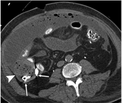

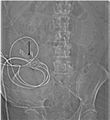

b

Figure 21. Gossypiboma in a 55-year-old patient with a history of colon cancer who presented with abdominal pain and sepsis after multiple abdominal surgeries. (a) Axial nonenhanced CT image shows a thick-walled collection of mottled air and fluid (arrowhead) in the right abdomen, which was initially thought to represent an abscess with peritonitis. (b) On further review, scout image shows a radiopaque lap pad marker (arrow), which corresponds to the radiopaque areas of attenuation with mild streak artifact on the CT image (arrows in a ).

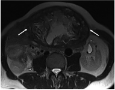

Figure 22. Gossypiboma in a 63-year-old patient with a remote history of liver transplantation who presented with abdominal swelling. (a) Axial T2-weighted MR image shows a heterogeneous predominantly hyperintense mass with peripheral low signal intensity in the anterior abdomen (arrows). Note the whorled appearance. (b) Axial contrast-enhanced T1-weighted image shows peripheral enhancement of the mass (arrows). Initial differential considerations included hematoma and abscess. No radiopaque marker was noted. The mass was surgically removed, revealing a gossypiboma with a retained surgical towel.

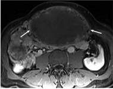

(63-65). To avoid misinterpretation, it is important to be aware of this entity and the classic MR imaging and CT appearance.

## Conclusion

A variety of entities in the abdomen and pelvis can manifest with imaging findings that could be mistaken for drainable fluid collections or abscesses. These entities include neoplasms, ischemia/infarction, diverticula, congenital variants, postoperative changes, nonpyogenic infection, and inflammatory conditions. Misdiagnosis may lead to unnecessary interventions and further complications. However, there are imaging features that may be recognized to avoid misdiagnosis.

Recognition of a prominent soft-tissue component of a mass, associated lymphadenopathy, masses or implants in other locations, and other associated findings should help lead to the appropriate diagnosis and allow distinction of these entities from drainable fluid collections. Review of any available prior imaging studies is essential, and any available medical and surgical history will often help facilitate accurate diagnosis. On occasion, a follow-up examination using a different imaging modality may help avoid further unnecessary intervention. Radiologists should be aware of key features of these entities to facilitate appropriate treatment of the patient.

## References

- 1. Wolverson MK, Jagannadharao B, Sundaram M, Joyce PF, Riaz MA, Shields JB. CT as a primary diagnostic method in evaluating intraabdominal abscess. AJR Am J Roentgenol 1979;133(6):1089-1095.
- 2. Johnson SA, Kumar A, Matasar MJ, Schöder H, Rademaker J.  Imaging  for  staging  and  response  assessment  in  lymphoma. Radiology 2015;276(2):323-338.
- 3. Shirkhoda A, Staab EV, Mittelstaedt CA. Renal lymphoma imaged by  ultrasound  and  gallium-67.  Radiology  1980;137(1 Pt 1):175-180.
- 4. Fishman  EK,  Kuhlman  JE,  Jones  RJ.  CT  of  lymphoma: spectrum of disease. RadioGraphics 1991;11(4):647-669.
- 5. Smathers RL, Lee JK, Heiken JP. Differentiation of complicated cholecystitis from gallbladder carcinoma by computed tomography. AJR Am J Roentgenol 1984;143(2):255-259.
- 6. Goldin RD, Roa JC. Gallbladder cancer: a morphological  and  molecular  update.  Histopathology  2009;55(2): 218-229.
- 7. Furlan A, Ferris JV, Hosseinzadeh K, Borhani AA. Gallbladder carcinoma update: multimodality imaging evaluation, staging, and treatment options. AJR Am J Roentgenol 2008;191(5):1440-1447.
- 8. Matsusaka S, Yamasaki H, Kitayama Y, Okada T, Maeda S. Occult gallbladder carcinoma diagnosed by a laparoscopic cholecystectomy. Surg Today 2003;33(10):740-742.
- 9. Yun EJ, Cho SG, Park S, et al. Gallbladder carcinoma and chronic cholecystitis: differentiation with two-phase spiral CT. Abdom Imaging 2004;29(1):102-108.
- 10.   Tran  T,  Davila  JA,  El-Serag  HB.  The  epidemiology  of malignant  gastrointestinal  stromal  tumors:  an  analysis of  1,458  cases  from  1992  to  2000.  Am  J  Gastroenterol 2005;100(1):162-168.
- 11.   Tateishi U, Hasegawa T, Satake M, Moriyama N. Gastrointestinal stromal tumor: correlation of computed tomography findings with tumor grade and mortality. J Comput Assist Tomogr 2003;27(5):792-798.
- 12.   Tapasvi C, Prajapati N, Madhok R, Gupta AK, Taneja V, Aggarwal A.  Evaluation  of  bowel  wall  thickening  by  computed tomography to differentiate benign from malignant lesions. J Clin Diagn Res 2014;8(11):RC09-RC12.
- 13.   Javadi S, Ganeshan DM, Qayyum A, Iyer RB, Bhosale P. Ovarian cancer,  the  revised  FIGO  staging  system,  and  the  role of imaging. AJR Am J Roentgenol 2016;206(6):1351-1360.
- 14.   DeCostanzo  DC,  Elias  JM,  Chumas  JC.  Necrosis  in  84  ovarian carcinomas:  a  morphologic  study  of  primary  versus  metastatic colonic  carcinoma  with  a  selective  immunohistochemical analysis of cytokeratin subtypes and carcinoembryonic antigen. Int J Gynecol Pathol 1997;16(3):245-249.
- 15.   Cronin P, Crosse B, Lane G, Spencer JA. Computed tomography findings of gaseous necrosis in epithelial ovarian cancer: a report of three cases. J Comput Assist Tomogr 2002;26(5):740-742.
- 16.   Kawashima A, Goldman SM, Fishman EK, et al. CT of intraabdominal desmoid tumors: is the tumor different in patients  with  Gardner's  disease?  AJR  Am  J  Roentgenol 1994;162(2):339-342.
- 17.   Tan CH, Pua U, Liau KH, Lee HY. Mesenteric desmoid tumour masquerading as a fat-containing cystic mass. Br J Radiol 2010;83(994):e200-e203.
- 18.   Cholongitas  E,  Koulenti  D,  Panetsos  G,  et  al.  Desmoid tumor presenting as intra-abdominal abscess. Dig Dis Sci 2006;51(1):68-69.
- 19.   Maldjian  C,  Mitty  H,  Garten  A,  Forman  W.  Abscess  formation in  desmoid tumors of Gardner's syndrome and percutaneous drainage: a report of three cases. Cardiovasc Intervent Radiol 1995;18(3):168-171.
- 20.   Rha SE, Byun JY, Jung SE, et al. Atypical CT and MRI manifestations of mature ovarian cystic teratomas. AJR Am J Roentgenol 2004;183(3):743-750.
- 21.   Buy JN, Ghossain MA, Moss AA, et al. Cystic teratoma of the ovary: CT detection. Radiology 1989;171(3):697-701.
- 22.   Caspi B, Appelman Z, Rabinerson D, Zalel Y, Tulandi T, Shoham Z. The growth pattern of ovarian dermoid cysts: a prospective  study  in  premenopausal  and  postmenopausal women. Fertil Steril 1997;68(3):501-505.
- 23.   Park SB, Kim JK, Kim KR, Cho KS. Imaging findings of complications and unusual manifestations of ovarian teratomas. RadioGraphics 2008;28(4):969-983.
- 24.   Shyn  PB,  Madan  R,  Wu  C,  Erturk  SM,  Silverman  SG. PET/CT pattern analysis for surgical staple line recurrence in  patients  with  colorectal  cancer.  AJR  Am  J  Roentgenol 2010;194(2):414-421.
- 25.   Ouchi A, Asano M, Aono K, Watanabe T, Oya S. Stapleline recurrence arising 10 years after functional end-to-end anastomosis for colon cancer: a case report. Surg Case Rep 2015;1(1):7.
- 26.   Eberhardt JM, Kiran RP, Lavery IC. The impact of anastomotic leak and intra-abdominal abscess on cancer-related outcomes after resection for colorectal cancer: a case control study. Dis Colon Rectum 2009;52(3):380-386.
- 27.   Hall MC, Womack S, Sagalowsky AI, Carmody T, Erickstad MD, Roehrborn CG. Prognostic factors, recurrence, and  survival  in  transitional  cell  carcinoma  of  the  upper urinary tract: a 30-year experience in 252 patients. Urology 1998;52(4):594-601.
- 28.   Molina R, Alvarez M, Capilla J, Páez A. Radiofrequencytreated  recurrence  of  urothelial  carcinoma  of  the  upper urinary  tract  after  nephroureterectomy.  Korean  J  Urol 2014;55(12):844-846.
- 29.   Catton  CN,  Warde  P,  Gospodarowicz  MK,  et  al.  Transitional cell carcinoma of the renal pelvis and ureter: outcome and patterns  of  relapse  in  patients  treated  with  postoperative radiation. Urol Oncol 1996;2(6):171-176.
- 30.   Balcar I, Seltzer SE, Davis S, Geller S. CT patterns of splenic infarction:  a  clinical  and  experimental  study.  Radiology 1984;151(3):723-729.
- 31.   Mortelé  KJ,  Mortelé  B,  Silverman  SG.  CT  features  of the accessory spleen. AJR Am J Roentgenol 2004;183(6): 1653-1657.
- 32.   Siegel  MJ,  McAlister  WH.  Calyceal  diverticula  in  children:  unusual  features  and  complications.  Radiology 1979;131(1):79-82.
- 33.   Mullett R, Belfield JC, Vinjamuri S. Calyceal diverticulum: a mimic of different pathologies on multiple imaging modalities. J Radiol Case Rep 2012;6(9):10-17.
- 34.   Raja J, Mohareb AM, Bilori B. Recurrent urinary tract infections in an adult with a duplicated renal collecting system. Radiol Case Rep 2016;11(4):328-331.
- 35.   Zissin  R,  Apter  S,  Yaffe  D,  et  al.  Renal  duplication  with associated complications in adults: CT findings in 26 cases. Clin Radiol 2001;56(1):58-63.
- 36.   Davda S, Vohra A. Adult duplex kidneys: an important differential diagnosis in patients with abdominal cysts. JRSM Short Rep 2013;4(2):13.
- 37.   Cronan JJ, Amis ES, Zeman RK, Dorfman GS. Obstruction of the upper-pole moiety in renal duplication in adults: CT evaluation. Radiology 1986;161(1):17-21.
- 38.   Fernbach SK, Zawin JK, Lebowitz RL. Complete duplication of the ureter with ureteropelvic junction obstruction of the lower pole of the kidney: imaging findings. AJR Am J Roentgenol 1995;164(3):701-704.
- 39.   Gayer  G,  Zissin  R,  Apter  S,  Shemesh  E,  Heldenberg  E. Acute diverticulitis of the small bowel: CT findings. Abdom Imaging 1999;24(5):452-455.
- 40.   Peoples  JB,  Lichtenberger  EJ,  Dunn  MM.  Incidental Meckel's diverticulectomy in adults. Surgery 1995;118(4): 649-652.
- 41.   Park JJ, Wolff BG, Tollefson MK, Walsh EE, Larson DR. Meckel diverticulum: the Mayo Clinic experience with 1476 patients (1950-2002). Ann Surg 2005;241(3):529-533.
- 42.   Macari M, Panicek DM. CT findings in acute necrotizing Meckel diverticulitis due to obstructing enterolith. J Comput Assist Tomogr 1995;19(5):808-810.
- 43.   Russ PD, Friefeld GD, Nauck CJ, Wilmouth RJ. Infarcted Meckel diverticulum detected by CT. AJR Am J Roentgenol 1988;150(2):299-300.
- 44.   Nigogosyan  M,  Dolinskas  C.  CT  demonstration  of  inflamed  Meckel  diverticulum.  J  Comput  Assist  Tomogr 1990;14(1):140-142.
- 45.   Choong CK, Frizelle FA. Giant colonic diverticulum: report of four cases and review of the literature. Dis Colon Rectum 1998;41(9):1178-1185; discussion 1185-1186.

- 46.   Nigri  G,  Petrucciani  N,  Giannini  G,  et  al.  Giant  colonic diverticulum:  clinical  presentation,  diagnosis  and  treatment-systematic review of 166 cases. World J Gastroenterol 2015;21(1):360-368.
- 47.   Zeina AR, Nachtigal A, Matter I, et al. Giant colon diverticulum: clinical and imaging findings in 17 patients with emphasis on CT criteria. Clin Imaging 2013;37(4):704-710.
- 48.   Roger T, Rommens J, Bailly J, Vollont GH, Belva P, Delcour C. Giant colonic diverticulum: presentation of one case and review  of  the  literature.  Abdom  Imaging  1996;21(6):530-533.
- 49.   Fields  SI,  Haskell  L,  Libson  E.  CT  appearance  of  giant  colonic diverticulum. Gastrointest Radiol 1987;12(1):71-72.
- 50.   Moomjian LN, Carucci LR, Guruli G, Klausner AP. Follow the stream: imaging of urinary diversions. RadioGraphics 2016;36(3):688-709.
- 51.   Levine MS, Carucci LR. Imaging of bariatric surgery: normal anatomy and postoperative complications. Radiology 2014;270(2):327-341.
- 52.   Merkle  EM,  Hallowell  PT,  Crouse  C,  Nakamoto  DA,  Stellato TA. Roux-en-Y gastric bypass for clinically severe obesity: normal appearance and spectrum of complications at imaging. Radiology 2005;234(3):674-683.
- 53.   Koh  DM,  Burn  PR,  Mathews  G,  Nelson  M,  Healy  JC. Abdominal computed tomographic findings of Mycobacterium tuberculosis and Mycobacterium avium intracellulare infection in HIV seropositive patients. Can Assoc Radiol J 2003;54(1):45-50.
- 54.   Suri  S,  Gupta  S,  Suri  R.  Computed  tomography  in  abdominal tuberculosis. Br J Radiol 1999;72(853):92-98.
- 55.   Karabicak I, Yurtseven I, Yuruker SS, Ozen N, Kesim M. Splenic hydatid cyst. Can J Surg 2009;52(5):E209-E210.
- 56.   Oruç  E,  Yıldırım  N,  Topal  NB,  Kılıçturgay  S,  Akgöz  S, Savcı G. The role of diffusion-weighted MRI in the classification of liver hydatid cysts and differentiation of simple cysts and abscesses from hydatid cysts. Diagn Interv Radiol 2010;16(4):279-287.
- 57.   Engin  G,  Acunas  B,  Rozanes  I,  Acunas  G.  Hydatid  disease  with unusual localization. Eur Radiol 2000;10(12):1904-1912.
- 58.   Beggs I. The radiology of hydatid disease. AJR Am J Roentgenol 1985;145(3):639-648.
- 59.   Korkes F, Favoretto RL, Bróglio M, Silva CA, Castro MG, Perez  MD.  Xanthogranulomatous  pyelonephritis:  clinical experience with 41 cases. Urology 2008;71(2):178-180.
- 60.   Hendrickson RJ, Lutfiyya WL, Karrer FM, Furness PD 3rd, Mengshol S, Bensard DD. Xanthogranulomatous pyelonephritis. J Pediatr Surg 2006;41(2):e15-e17.
- 61.   Eastham J, Ahlering T, Skinner E. Xanthogranulomatous pyelonephritis: clinical findings and surgical considerations. Urology 1994;43(3):295-299.
- 62.   Kim CK, Park BK, Ha H. Gossypiboma in abdomen and pelvis: MRI findings in four patients. AJR Am J Roentgenol 2007;189(4):814-817.
- 63.   Kopka L, Fischer U, Gross AJ, Funke M, Oestmann JW, Grabbe  E.  CT  of  retained  surgical  sponges  (textilomas): pitfalls in detection and evaluation. J Comput Assist Tomogr 1996;20(6):919-923.
- 64.   Choi BI, Kim SH, Yu ES, Chung HS, Han MC, Kim CW. Retained  surgical  sponge:  diagnosis  with  CT  and  sonography. AJR Am J Roentgenol 1988;150(5):1047-1050.
- 65.   Kokubo T, Itai Y, Ohtomo K, Yoshikawa K, Iio M, Atomi Y. Retained  surgical  sponges:  CT  and  US  appearance.  Radiology 1987;165(2):415-418.